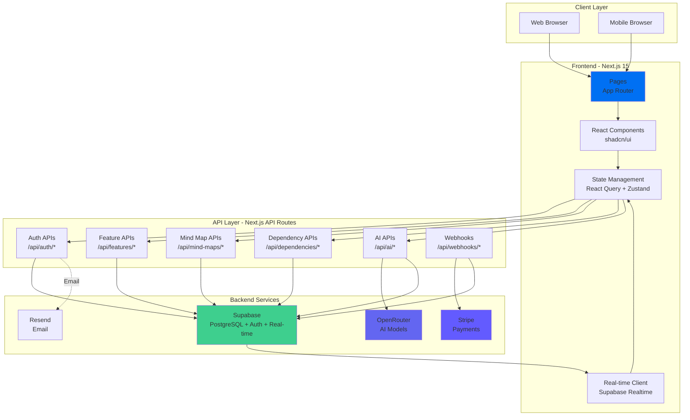
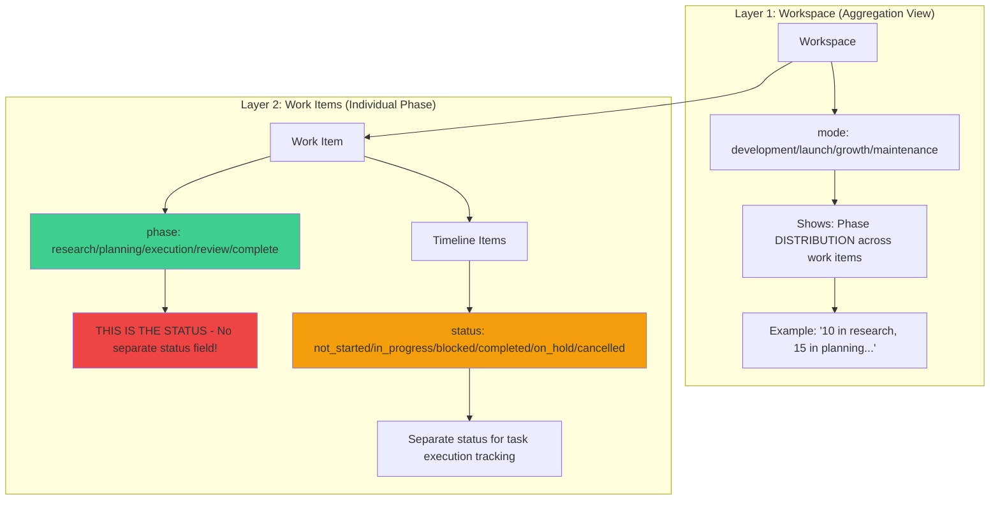
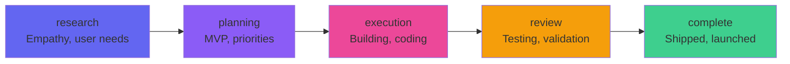
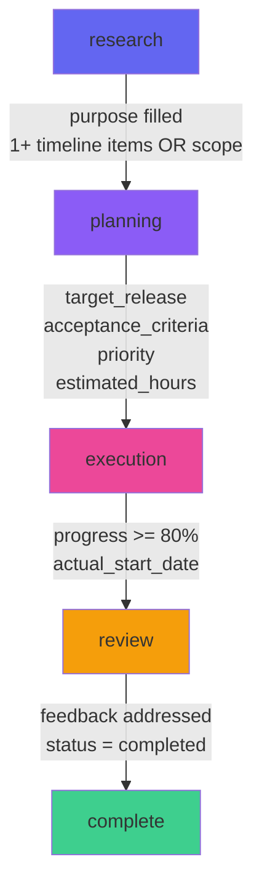
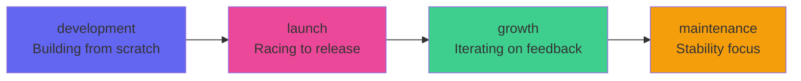
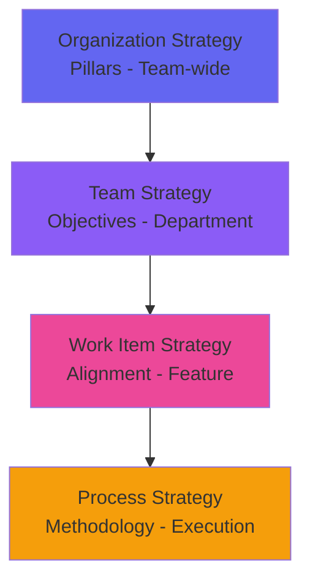
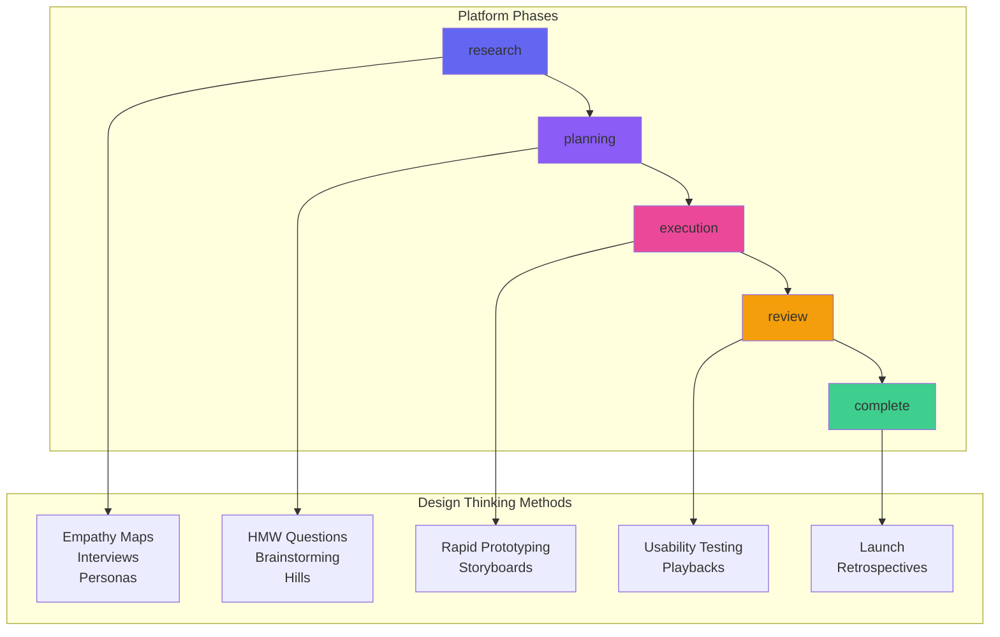
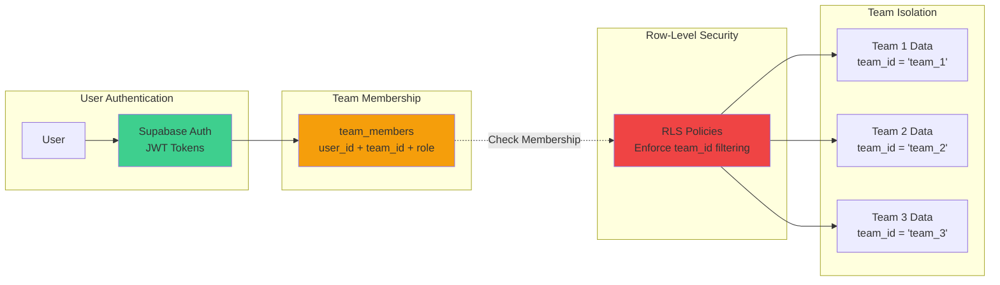
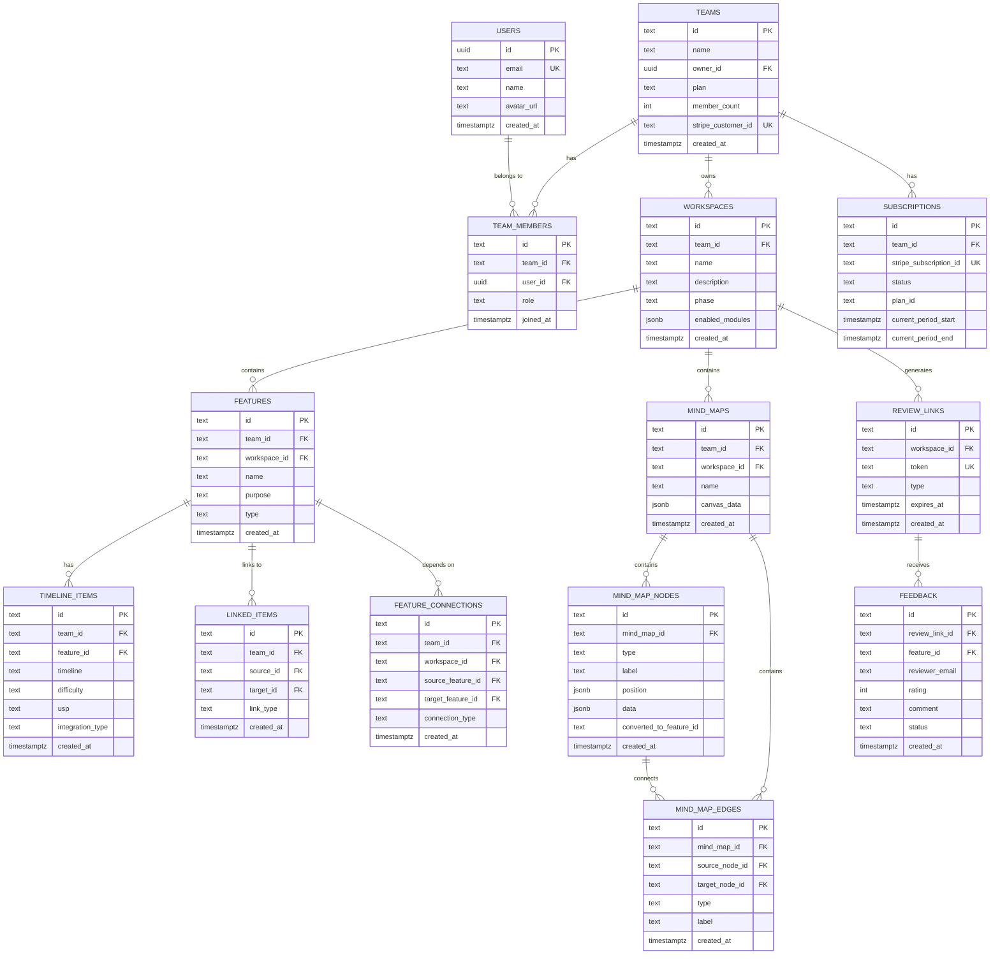

# 🏗️ SYSTEM ARCHITECTURE

> ⚠️ **Note**: For architecture DECISIONS (source of truth), see [ARCHITECTURE_CONSOLIDATION.md](../ARCHITECTURE_CONSOLIDATION.md).
> This document provides detailed technical diagrams and implementation specifics.

**Last Updated**: 2025-12-11
**Project**: Product Lifecycle Management Platform
**Tech Stack**: Next.js 15 + TypeScript + Supabase + Vercel

---

## 📋 TABLE OF CONTENTS

1. [High-Level Architecture](#high-level-architecture)
2. [Two-Layer System Architecture](#two-layer-system-architecture)
3. [Phase System](#phase-system)
4. [Workspace Modes](#workspace-modes)
5. [Strategy System](#strategy-system)
6. [Design Thinking Methodology](#design-thinking-methodology)
7. [Multi-Tenant Architecture](#multi-tenant-architecture)
8. [Database Schema](#database-schema)
9. [Authentication Flow](#authentication-flow)
10. [Data Flow - Key Features](#data-flow---key-features)
11. [API Architecture](#api-architecture)
12. [Real-time Collaboration](#real-time-collaboration)
13. [Deployment Architecture](#deployment-architecture)
14. [Technology Stack Details](#technology-stack-details)

---

## 🏛️ HIGH-LEVEL ARCHITECTURE



---

## 🏗️ TWO-LAYER SYSTEM ARCHITECTURE

### Core Principle: Two Layers, Not Three

The platform uses a **two-layer hierarchy**, not three. This is a critical architectural decision.



### Critical Clarifications

| Concept | Correct Understanding | Common Misconception |
|---------|----------------------|---------------------|
| **Phase vs Status** | Phase IS the status for work items | They are separate fields |
| **Workspace Stage** | Shows AGGREGATION (distribution) | Has single stage value |
| **Timeline Status** | Separate field for execution tasks | Same as work item phase |
| **Design Thinking** | Methodology/framework for HOW to work | Lifecycle stages |

---

## 🔄 PHASE SYSTEM

### Work Item Phases (= Status)

The `phase` field **IS** the status for work items. There is no separate `status` field.



| Phase | Description | Focus Area |
|-------|-------------|------------|
| **research** | Initial exploration, problem understanding | Empathy, user needs |
| **planning** | Structure, scope, timeline breakdown | MVP definition, priorities |
| **execution** | Active development work | Building, coding, creating |
| **review** | Testing, validation, feedback | Quality, user testing |
| **complete** | Shipped, launched, done | Retrospective, metrics |

### Timeline Item Status (Separate)

Timeline items (MVP/SHORT/LONG breakdowns) have a **separate** `status` field for execution tracking:

| Status | Description |
|--------|-------------|
| `not_started` | Task created but not begun |
| `in_progress` | Actively being worked on |
| `blocked` | Cannot proceed due to dependency |
| `completed` | Task finished |
| `on_hold` | Paused intentionally |
| `cancelled` | No longer needed |

### Phase Transition Requirements



| From → To | Required Fields | Rationale |
|-----------|-----------------|-----------|
| research → planning | `purpose` filled, 1+ timeline items OR scope defined | Ready to plan |
| planning → execution | `target_release`, `acceptance_criteria`, `priority`, `estimated_hours` | Planning complete |
| execution → review | `progress_percent` >= 80, `actual_start_date` set | Work substantially done |
| review → complete | Feedback addressed, `status` = 'completed' | Approved |

### Phase Upgrade Prompting

- **Threshold**: 80% field completion
- **Level**: Work item (NOT workspace)
- **Frequency**: Real-time as fields are filled
- **UI**: Banner in work item detail header

---

## 🎯 WORKSPACE MODES

### Four Lifecycle Modes

Workspaces operate in one of four modes, which influence UI, defaults, and recommendations:



| Mode | Description | Default Phase | Type Weight Focus |
|------|-------------|---------------|-------------------|
| **development** | Building from scratch | planning | feature (10), concept (9) |
| **launch** | Racing to release | execution | bug (10), feature (8) |
| **growth** | Iterating on feedback | review | enhancement (9), feature (7) |
| **maintenance** | Stability focus | execution | bug (10), enhancement (5) |

### Workspace Does NOT Have Stage

**Critical**: Workspaces do NOT have a single `stage` or `launch_stage` field.

Instead, workspaces show **phase distribution** across all work items:
- "Research: 10, Planning: 15, Execution: 8, Review: 3, Complete: 5"

This is an **aggregation view**, not a single stage value.

---

## 🎯 STRATEGY SYSTEM

### Four-Tier Hierarchy (Phase-Agnostic)

Strategy alignment is **independent** of work item phases. It's a separate organizational hierarchy:



### Strategy Levels

| Level | Name | Fields | Display |
|-------|------|--------|---------|
| **Pillar** | Organization-wide theme | user_stories, case_studies, examples | Full tree view |
| **Objective** | Team/department goal | metrics, owners | Nested under pillar |
| **Key Result** | Measurable outcome | target, actual | Progress indicators |
| **Initiative** | Specific action | timeline, assignees | Task-like cards |

### Different Displays by Context

**Organization Level**:
- Full strategy tree
- High-level metrics
- User stories, case studies
- Team-wide alignment

**Work Item Level**:
- Derived/aligned strategies only
- Alignment strength (weak/medium/strong)
- Specific requirements for this item
- Actionable view

### New Database Fields (Pillar Level)

```sql
user_stories TEXT[]     -- User story examples
user_examples TEXT[]    -- Real user examples
case_studies TEXT[]     -- Reference case studies
```

---

## 🧠 DESIGN THINKING METHODOLOGY

### What Design Thinking IS

Design Thinking is a **human-centered, iterative methodology** for HOW to implement ideas:
- **NOT** lifecycle stages
- **NOT** a replacement for phases
- **GUIDES** the approach at each phase

### Major Frameworks

| Framework | Source | Key Stages |
|-----------|--------|------------|
| **d.school 5 Modes** | Stanford | Empathize → Define → Ideate → Prototype → Test |
| **Double Diamond** | British Design Council | Discover → Define → Develop → Deliver |
| **IDEO HCD** | IDEO | Inspiration → Ideation → Implementation |
| **Enterprise DT** | IBM | The Loop + Hills, Playbacks, Sponsor Users |

### Mapping to Platform Phases



| Platform Phase | DT Methods | Guiding Questions |
|----------------|------------|-------------------|
| **Research** | Empathy Maps, Interviews, Personas | "Who has this problem?" |
| **Planning** | HMW Questions, Brainstorming, Hills | "What's the MVP?" |
| **Execution** | Rapid Prototyping, Storyboards | "How do we build it?" |
| **Review** | Usability Testing, Playbacks | "Does it solve the problem?" |
| **Complete** | Launch, Retrospectives | "What did we learn?" |

### AI Integration

- AI **actively suggests** Design Thinking methods
- Shows guiding questions as tooltips/hints
- References case studies for inspiration
- Knows other frameworks (Agile, Lean Startup, JTBD)

---

## 🏢 MULTI-TENANT ARCHITECTURE

### Isolation Strategy



### Data Isolation Model

**Key Principles:**
- Every table has `team_id` column
- Row-Level Security (RLS) enforces team boundaries
- JWT token contains user ID, RLS policies check team membership
- No shared data between teams (zero data leakage)

**RLS Policy Pattern:**
```sql
-- Read access: User must be member of the team
CREATE POLICY "team_members_can_read"
ON features FOR SELECT
USING (
  team_id IN (
    SELECT team_id FROM team_members
    WHERE user_id = auth.uid()
  )
);

-- Write access: Same constraint
CREATE POLICY "team_members_can_insert"
ON features FOR INSERT
WITH CHECK (
  team_id IN (
    SELECT team_id FROM team_members
    WHERE user_id = auth.uid()
  )
);
```

---

## 🗄️ DATABASE SCHEMA

### Entity Relationship Diagram



### Table Categories

**Core Tables (Multi-Tenancy):**
- `users` - User accounts (Supabase Auth)
