- `teams` - Organizations
- `team_members` - Team membership with roles
- `subscriptions` - Stripe billing
- `workspaces` - Projects

**Feature Tables:**
- `features` - Top-level roadmap items
- `timeline_items` - MVP/SHORT/LONG breakdown
- `linked_items` - Feature relationships
- `feature_connections` - Dependency graph

**Mind Mapping Tables:**
- `mind_maps` - Canvas data
- `mind_map_nodes` - Individual nodes (5 types)
- `mind_map_edges` - Connections

**Review & Feedback Tables:**
- `review_links` - Public/invite/iframe links
- `feedback` - Reviewer submissions

---

## 🔐 AUTHENTICATION FLOW

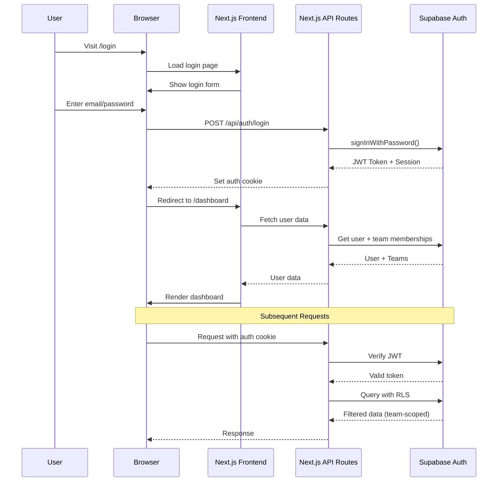

### Auth Middleware

**Route Protection:**
```typescript
// middleware.ts
export async function middleware(req: NextRequest) {
  const supabase = createMiddlewareClient({ req, res });
  const { data: { session } } = await supabase.auth.getSession();

  // Protected routes
  if (!session && req.nextUrl.pathname.startsWith('/dashboard')) {
    return NextResponse.redirect(new URL('/login', req.url));
  }

  // Auth routes (redirect if logged in)
  if (session && ['/login', '/signup'].includes(req.nextUrl.pathname)) {
    return NextResponse.redirect(new URL('/dashboard', req.url));
  }

  return NextResponse.next();
}
```

---

## 🔄 DATA FLOW - KEY FEATURES

### Mind Map to Features Conversion

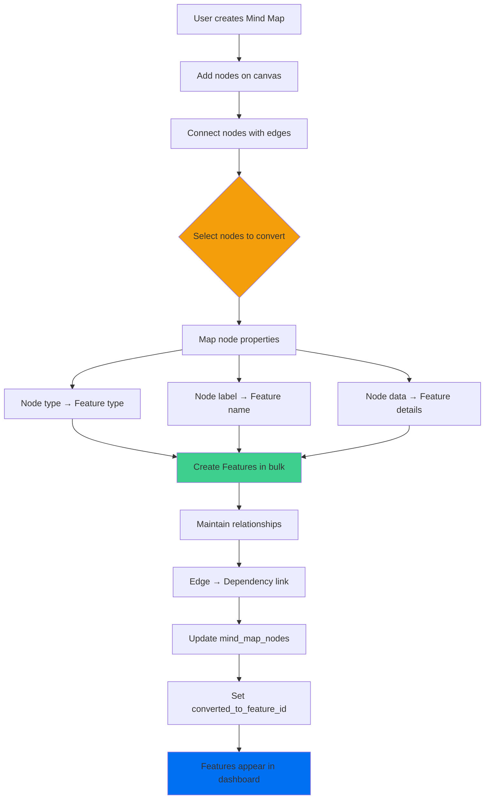

### Dependency Graph Analysis

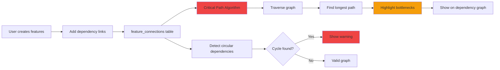

### Real-time Collaboration Flow

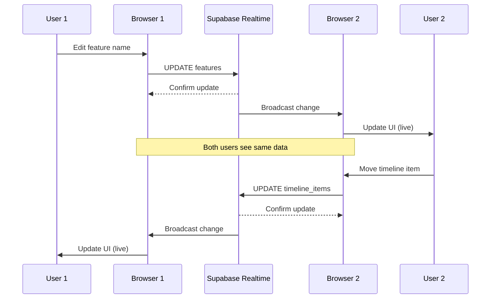

---

## 🌐 API ARCHITECTURE

### API Routes Structure

```
next-app/app/api/
├── auth/
│   ├── login/route.ts
│   ├── signup/route.ts
│   ├── logout/route.ts
│   └── session/route.ts
├── teams/
│   ├── route.ts (GET, POST)
│   ├── [id]/route.ts (GET, PATCH, DELETE)
│   └── [id]/members/route.ts
├── workspaces/
│   ├── route.ts (GET, POST)
│   └── [id]/route.ts (GET, PATCH, DELETE)
├── features/
│   ├── route.ts (GET, POST)
│   ├── [id]/route.ts (GET, PATCH, DELETE)
│   └── [id]/timeline-items/route.ts
├── mind-maps/
│   ├── route.ts (GET, POST)
│   ├── [id]/route.ts (GET, PATCH, DELETE)
│   ├── [id]/nodes/route.ts
│   └── [id]/convert-to-features/route.ts
├── dependencies/
│   ├── route.ts (GET, POST)
│   ├── [id]/route.ts (DELETE)
│   └── analyze/route.ts (GET - critical path)
├── ai/
│   ├── chat/route.ts (POST - streaming)
│   ├── suggest/route.ts (POST - suggestions)
│   └── tools/route.ts (POST - agentic mode)
└── webhooks/
    ├── stripe/route.ts
    └── resend/route.ts
```

### API Response Pattern

```typescript
// Success Response
{
  success: true,
  data: { ... },
  message: "Operation successful"
}

// Error Response
{
  success: false,
  error: {
    code: "VALIDATION_ERROR",
    message: "Invalid input data",
    details: { ... }
  }
}
```

### API Middleware Stack

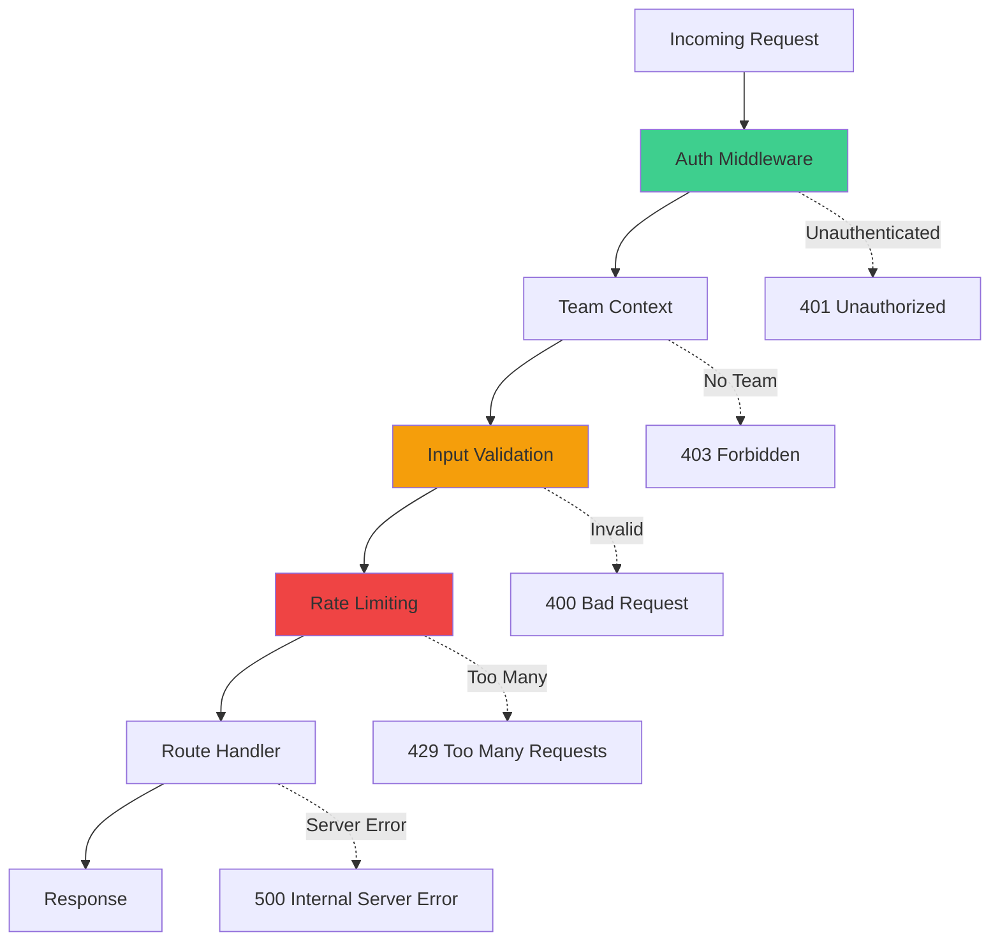

---

## 🔄 REAL-TIME COLLABORATION

### Supabase Realtime Architecture

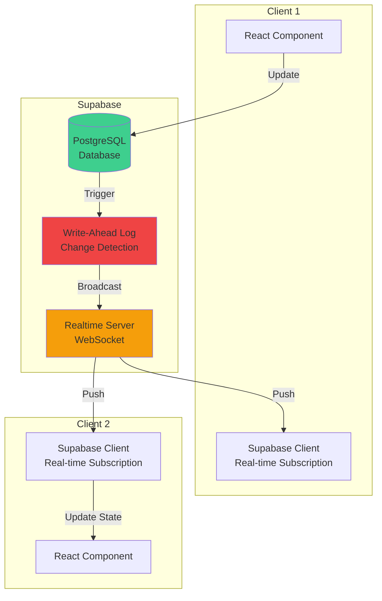

### Subscription Pattern

```typescript
// Subscribe to workspace changes
useEffect(() => {
  const channel = supabase
    .channel(`workspace_${workspaceId}`)
    .on(
      'postgres_changes',
      {
        event: '*',
        schema: 'public',
        table: 'features',
        filter: `workspace_id=eq.${workspaceId}`
      },
      (payload) => {
        // Handle INSERT, UPDATE, DELETE
        queryClient.invalidateQueries(['features', workspaceId]);
      }
    )
    .subscribe();

  return () => {
    channel.unsubscribe();
  };
}, [workspaceId]);
```

---

## ☁️ DEPLOYMENT ARCHITECTURE

### Vercel Deployment

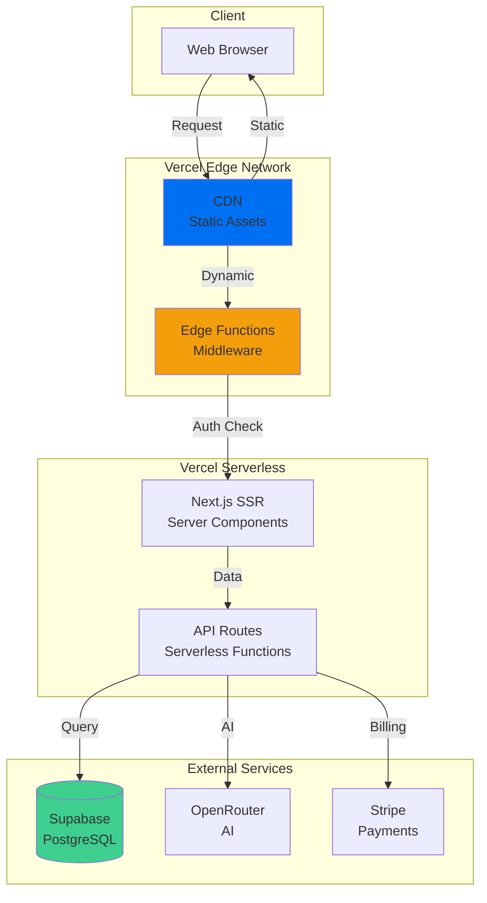

### Environment Configuration

```bash
# Supabase
NEXT_PUBLIC_SUPABASE_URL=https://xxx.supabase.co
NEXT_PUBLIC_SUPABASE_ANON_KEY=xxx
SUPABASE_SERVICE_ROLE_KEY=xxx

# OpenRouter (AI)
OPENROUTER_API_KEY=xxx

# Stripe (Payments)
STRIPE_SECRET_KEY=sk_live_xxx
STRIPE_WEBHOOK_SECRET=whsec_xxx
NEXT_PUBLIC_STRIPE_PUBLISHABLE_KEY=pk_live_xxx

# Resend (Email)
RESEND_API_KEY=re_xxx

# App Config
NEXT_PUBLIC_APP_URL=https://platform-test-cyan.vercel.app
```

---

## 🛠️ TECHNOLOGY STACK DETAILS

### Frontend Stack

```mermaid
graph LR
    subgraph "Framework"
        NextJS[Next.js 15<br/>App Router + RSC]
    end

    subgraph "Language"
        TS[TypeScript 5.x<br/>Strict Mode]
    end

    subgraph "UI Library"
        shadcn[shadcn/ui<br/>Radix UI]
        Tailwind[Tailwind CSS 3.x]
        Lucide[Lucide React<br/>Icons]
    end

    subgraph "State Management"
        ReactQuery[React Query<br/>Server State]
        Zustand[Zustand<br/>Client State]
    end

    subgraph "Specialized"
        ReactFlow[ReactFlow<br/>Mind Mapping]
        Recharts[Recharts<br/>Analytics]
    end

    NextJS --> TS
    TS --> shadcn
    TS --> ReactQuery
    TS --> ReactFlow
    shadcn --> Tailwind
    shadcn --> Lucide
    ReactQuery --> Zustand
    ReactFlow --> Recharts

    style NextJS fill:#0070f3
    style TS fill:#3178c6
    style shadcn fill:#18181b
```

### Backend Stack

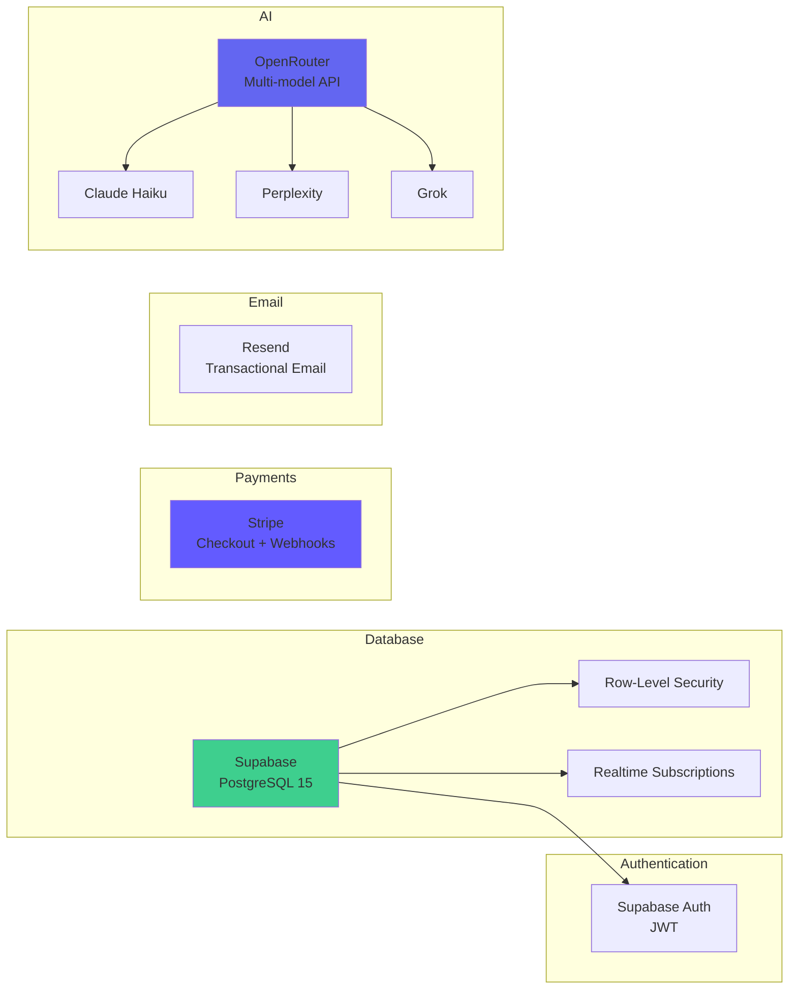

### Testing Stack

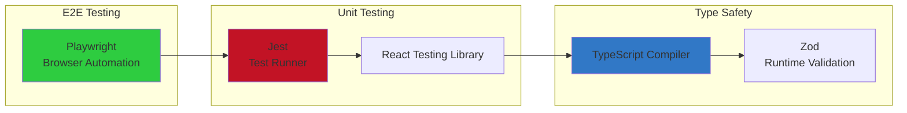

---

## 📊 PERFORMANCE CONSIDERATIONS

### Data Loading Strategy

**1. Server Components (RSC)**
- Fetch data on server
- No client-side loading states
- Automatic code splitting

**2. React Query (Client State)**
- Cache server data
- Background refetching
- Optimistic updates

**3. Streaming SSR**
- Progressive page rendering
- Suspense boundaries
- Priority-based loading

### Caching Strategy

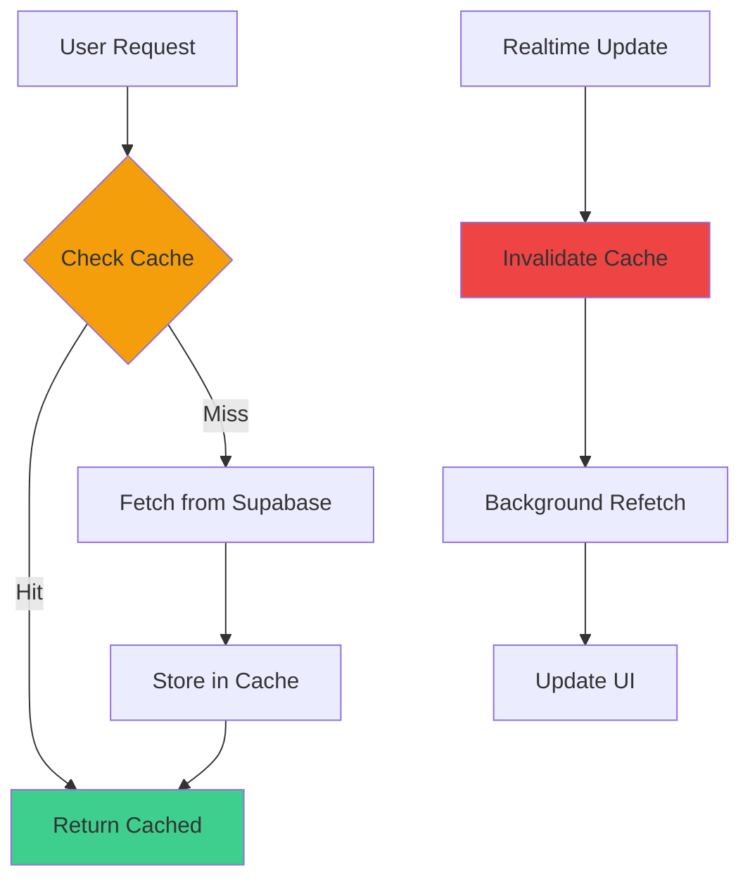

---

## 🔒 SECURITY ARCHITECTURE

### Security Layers

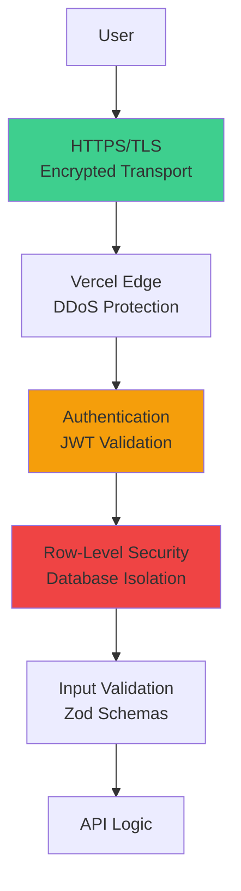

### Threat Mitigation

| Threat | Mitigation |
|--------|------------|
| **SQL Injection** | Supabase prepared statements, Zod validation |
| **XSS** | React auto-escaping, Content Security Policy |
| **CSRF** | SameSite cookies, CORS configuration |
| **Data Leakage** | RLS policies, team_id filtering |
| **Rate Limiting** | Vercel Edge, API middleware |
| **DDoS** | Vercel Edge Network, CDN |

---

## 📚 REFERENCES

- **Next.js Documentation**: [https://nextjs.org/docs](https://nextjs.org/docs)
- **Supabase Documentation**: [https://supabase.com/docs](https://supabase.com/docs)
- **ReactFlow Documentation**: [https://reactflow.dev](https://reactflow.dev)
- **Stripe Documentation**: [https://stripe.com/docs](https://stripe.com/docs)

---

## 🔗 RELATED DOCUMENTATION

- [Implementation Plan](../implementation/README.md) - Detailed implementation timeline
- [API Reference](API_REFERENCE.md) - API endpoints documentation
- [Project Guidelines](../../CLAUDE.md) - Project guidelines and coding standards
- [README](../../README.md) - Project overview and quick start

---

**Last Updated**: 2025-11-14
**Version**: 1.0
**Status**: Living Document (update as architecture evolves)
