# 🏗️ SYSTEM ARCHITECTURE

**Last Updated**: 2025-12-11
**Project**: Product Lifecycle Management Platform
**Tech Stack**: Next.js 15 + TypeScript + Supabase + Vercel

---

## 📋 TABLE OF CONTENTS

1. [High-Level Architecture](#high-level-architecture)
2. [Two-Layer System Architecture](#two-layer-system-architecture)
3. [Phase System](#phase-system)
4. [Workspace Modes](#workspace-modes)
5. [Strategy System](#strategy-system)
6. [Design Thinking Methodology](#design-thinking-methodology)
7. [Multi-Tenant Architecture](#multi-tenant-architecture)
8. [Database Schema](#database-schema)
9. [Authentication Flow](#authentication-flow)
10. [Data Flow - Key Features](#data-flow---key-features)
11. [API Architecture](#api-architecture)
12. [Real-time Collaboration](#real-time-collaboration)
13. [Deployment Architecture](#deployment-architecture)
14. [Technology Stack Details](#technology-stack-details)

---

## 🏛️ HIGH-LEVEL ARCHITECTURE

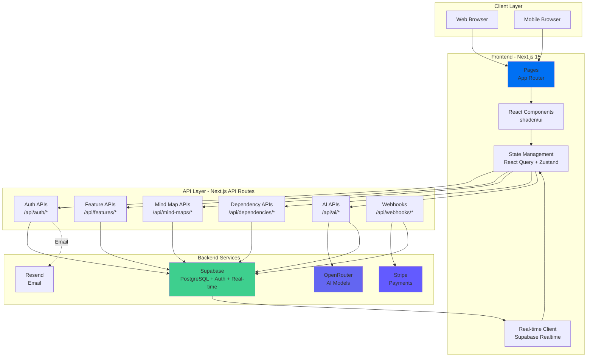
```mermaid
graph TB
    subgraph "Client Layer"
        Browser[Web Browser]
        Mobile[Mobile Browser]
    end

    subgraph "Frontend - Next.js 15"
        Pages[Pages<br/>App Router]
        Components[React Components<br/>shadcn/ui]
        State[State Management<br/>React Query + Zustand]
        RealTime[Real-time Client<br/>Supabase Realtime]
    end

    subgraph "API Layer - Next.js API Routes"
        Auth[Auth APIs<br/>/api/auth/*]
        Features[Feature APIs<br/>/api/features/*]
        MindMaps[Mind Map APIs<br/>/api/mind-maps/*]
        Dependencies[Dependency APIs<br/>/api/dependencies/*]
        AI[AI APIs<br/>/api/ai/*]
        Webhooks[Webhooks<br/>/api/webhooks/*]
    end

    subgraph "Backend Services"
        Supabase[Supabase<br/>PostgreSQL + Auth + Real-time]
        OpenRouter[OpenRouter<br/>AI Models]
        Stripe[Stripe<br/>Payments]
        Resend[Resend<br/>Email]
    end

    Browser --> Pages
    Mobile --> Pages
    Pages --> Components
    Components --> State
    State --> Auth
    State --> Features
    State --> MindMaps
    State --> Dependencies
    State --> AI

    Auth --> Supabase
    Features --> Supabase
    MindMaps --> Supabase
    Dependencies --> Supabase
    AI --> OpenRouter
    AI --> Supabase
    Webhooks --> Stripe
    Webhooks --> Supabase

    Supabase --> RealTime
    RealTime --> State

    Auth -.Email.-> Resend

    style Supabase fill:#3ecf8e
    style OpenRouter fill:#6366f1
    style Stripe fill:#635bff
    style Pages fill:#0070f3
```

---

## 🏗️ TWO-LAYER SYSTEM ARCHITECTURE

### Core Principle: Two Layers, Not Three

The platform uses a **two-layer hierarchy**, not three. This is a critical architectural decision.

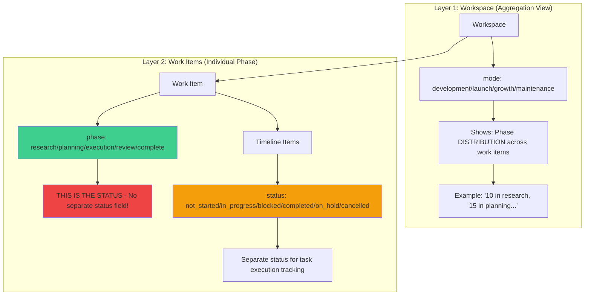
```mermaid
graph TD
    subgraph "Layer 1: Workspace (Aggregation View)"
        W[Workspace]
        W --> Mode[mode: development/launch/growth/maintenance]
        Mode --> Distribution[Shows: Phase DISTRIBUTION across work items]
        Distribution --> Example["Example: '10 in research, 15 in planning...'"]
    end

    subgraph "Layer 2: Work Items (Individual Phase)"
        WI[Work Item]
        WI --> Phase[phase: research/planning/execution/review/complete]
        Phase --> StatusNote[THIS IS THE STATUS - No separate status field!]

        WI --> Timeline[Timeline Items]
        Timeline --> TStatus[status: not_started/in_progress/blocked/completed/on_hold/cancelled]
        TStatus --> Note[Separate status for task execution tracking]
    end

    W --> WI

    style Phase fill:#3ecf8e
    style TStatus fill:#f59e0b
    style StatusNote fill:#ef4444
```

### Critical Clarifications

| Concept | Correct Understanding | Common Misconception |
|---------|----------------------|---------------------|
| **Phase vs Status** | Phase IS the status for work items | They are separate fields |
| **Workspace Stage** | Shows AGGREGATION (distribution) | Has single stage value |
| **Timeline Status** | Separate field for execution tasks | Same as work item phase |
| **Design Thinking** | Methodology/framework for HOW to work | Lifecycle stages |

---

## 🔄 PHASE SYSTEM

### Work Item Phases (= Status)

The `phase` field **IS** the status for work items. There is no separate `status` field.

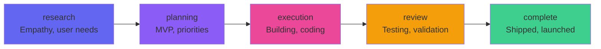
```mermaid
graph LR
    Research[research<br/>Empathy, user needs] --> Planning[planning<br/>MVP, priorities]
    Planning --> Execution[execution<br/>Building, coding]
    Execution --> Review[review<br/>Testing, validation]
    Review --> Complete[complete<br/>Shipped, launched]

    style Research fill:#6366f1
    style Planning fill:#8b5cf6
    style Execution fill:#ec4899
    style Review fill:#f59e0b
    style Complete fill:#3ecf8e
```

| Phase | Description | Focus Area |
|-------|-------------|------------|
| **research** | Initial exploration, problem understanding | Empathy, user needs |
| **planning** | Structure, scope, timeline breakdown | MVP definition, priorities |
| **execution** | Active development work | Building, coding, creating |
| **review** | Testing, validation, feedback | Quality, user testing |
| **complete** | Shipped, launched, done | Retrospective, metrics |

### Timeline Item Status (Separate)

Timeline items (MVP/SHORT/LONG breakdowns) have a **separate** `status` field for execution tracking:

| Status | Description |
|--------|-------------|
| `not_started` | Task created but not begun |
| `in_progress` | Actively being worked on |
| `blocked` | Cannot proceed due to dependency |
| `completed` | Task finished |
| `on_hold` | Paused intentionally |
| `cancelled` | No longer needed |

### Phase Transition Requirements

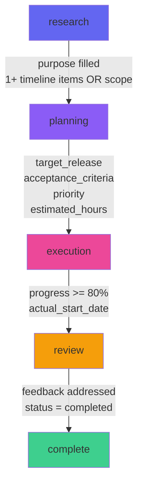
```mermaid
graph TD
    R[research] -->|purpose filled<br/>1+ timeline items OR scope| P[planning]
    P -->|target_release<br/>acceptance_criteria<br/>priority<br/>estimated_hours| E[execution]
    E -->|progress >= 80%<br/>actual_start_date| Rev[review]
    Rev -->|feedback addressed<br/>status = completed| C[complete]

    style R fill:#6366f1
    style P fill:#8b5cf6
    style E fill:#ec4899
    style Rev fill:#f59e0b
    style C fill:#3ecf8e
```

| From → To | Required Fields | Rationale |
|-----------|-----------------|-----------|
| research → planning | `purpose` filled, 1+ timeline items OR scope defined | Ready to plan |
| planning → execution | `target_release`, `acceptance_criteria`, `priority`, `estimated_hours` | Planning complete |
| execution → review | `progress_percent` >= 80, `actual_start_date` set | Work substantially done |
| review → complete | Feedback addressed, `status` = 'completed' | Approved |

### Phase Upgrade Prompting

- **Threshold**: 80% field completion
- **Level**: Work item (NOT workspace)
- **Frequency**: Real-time as fields are filled
- **UI**: Banner in work item detail header

---

## 🎯 WORKSPACE MODES

### Four Lifecycle Modes

Workspaces operate in one of four modes, which influence UI, defaults, and recommendations:

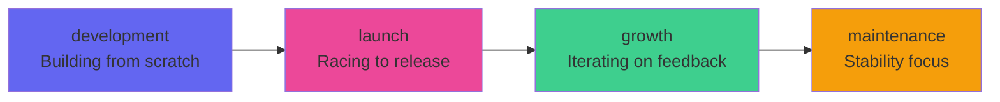
```mermaid
graph LR
    Dev[development<br/>Building from scratch] --> Launch[launch<br/>Racing to release]
    Launch --> Growth[growth<br/>Iterating on feedback]
    Growth --> Maint[maintenance<br/>Stability focus]

    style Dev fill:#6366f1
    style Launch fill:#ec4899
    style Growth fill:#3ecf8e
    style Maint fill:#f59e0b
```

| Mode | Description | Default Phase | Type Weight Focus |
|------|-------------|---------------|-------------------|
| **development** | Building from scratch | planning | feature (10), concept (9) |
| **launch** | Racing to release | execution | bug (10), feature (8) |
| **growth** | Iterating on feedback | review | enhancement (9), feature (7) |
| **maintenance** | Stability focus | execution | bug (10), enhancement (5) |

### Workspace Does NOT Have Stage

**Critical**: Workspaces do NOT have a single `stage` or `launch_stage` field.

Instead, workspaces show **phase distribution** across all work items:
- "Research: 10, Planning: 15, Execution: 8, Review: 3, Complete: 5"

This is an **aggregation view**, not a single stage value.

---

## 🎯 STRATEGY SYSTEM

### Four-Tier Hierarchy (Phase-Agnostic)

Strategy alignment is **independent** of work item phases. It's a separate organizational hierarchy:

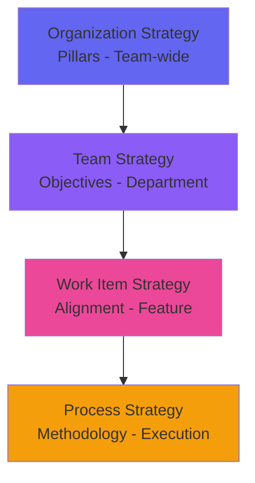
```mermaid
graph TD
    Org[Organization Strategy<br/>Pillars - Team-wide] --> Team[Team Strategy<br/>Objectives - Department]
    Team --> WorkItem[Work Item Strategy<br/>Alignment - Feature]
    WorkItem --> Process[Process Strategy<br/>Methodology - Execution]

    style Org fill:#6366f1
    style Team fill:#8b5cf6
    style WorkItem fill:#ec4899
    style Process fill:#f59e0b
```

### Strategy Levels

| Level | Name | Fields | Display |
|-------|------|--------|---------|
| **Pillar** | Organization-wide theme | user_stories, case_studies, examples | Full tree view |
| **Objective** | Team/department goal | metrics, owners | Nested under pillar |
| **Key Result** | Measurable outcome | target, actual | Progress indicators |
| **Initiative** | Specific action | timeline, assignees | Task-like cards |

### Different Displays by Context

**Organization Level**:
- Full strategy tree
- High-level metrics
- User stories, case studies
- Team-wide alignment

**Work Item Level**:
- Derived/aligned strategies only
- Alignment strength (weak/medium/strong)
- Specific requirements for this item
- Actionable view

### New Database Fields (Pillar Level)

```sql
user_stories TEXT[]     -- User story examples
user_examples TEXT[]    -- Real user examples
case_studies TEXT[]     -- Reference case studies
```

---

## 🧠 DESIGN THINKING METHODOLOGY

### What Design Thinking IS

Design Thinking is a **human-centered, iterative methodology** for HOW to implement ideas:
- **NOT** lifecycle stages
- **NOT** a replacement for phases
- **GUIDES** the approach at each phase

### Major Frameworks

| Framework | Source | Key Stages |
|-----------|--------|------------|
| **d.school 5 Modes** | Stanford | Empathize → Define → Ideate → Prototype → Test |
| **Double Diamond** | British Design Council | Discover → Define → Develop → Deliver |
| **IDEO HCD** | IDEO | Inspiration → Ideation → Implementation |
| **Enterprise DT** | IBM | The Loop + Hills, Playbacks, Sponsor Users |

### Mapping to Platform Phases

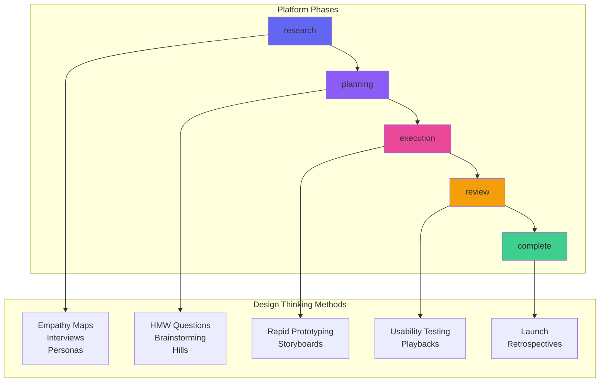
```mermaid
graph TD
    subgraph "Platform Phases"
        R[research] --> P[planning]
        P --> E[execution]
        E --> Rev[review]
        Rev --> C[complete]
    end

    subgraph "Design Thinking Methods"
        R --> Empathy[Empathy Maps<br/>Interviews<br/>Personas]
        P --> HMW[HMW Questions<br/>Brainstorming<br/>Hills]
        E --> Proto[Rapid Prototyping<br/>Storyboards]
        Rev --> Test[Usability Testing<br/>Playbacks]
        C --> Launch[Launch<br/>Retrospectives]
    end

    style R fill:#6366f1
    style P fill:#8b5cf6
    style E fill:#ec4899
    style Rev fill:#f59e0b
    style C fill:#3ecf8e
```

| Platform Phase | DT Methods | Guiding Questions |
|----------------|------------|-------------------|
| **Research** | Empathy Maps, Interviews, Personas | "Who has this problem?" |
| **Planning** | HMW Questions, Brainstorming, Hills | "What's the MVP?" |
| **Execution** | Rapid Prototyping, Storyboards | "How do we build it?" |
| **Review** | Usability Testing, Playbacks | "Does it solve the problem?" |
| **Complete** | Launch, Retrospectives | "What did we learn?" |

### AI Integration

- AI **actively suggests** Design Thinking methods
- Shows guiding questions as tooltips/hints
- References case studies for inspiration
- Knows other frameworks (Agile, Lean Startup, JTBD)

---

## 🏢 MULTI-TENANT ARCHITECTURE

### Isolation Strategy

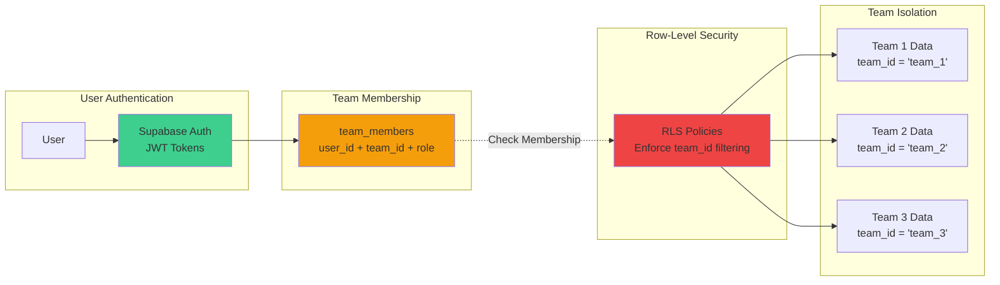
```mermaid
graph LR
    subgraph "User Authentication"
        User[User]
        SupabaseAuth[Supabase Auth<br/>JWT Tokens]
    end

    subgraph "Team Membership"
        TeamMembers[team_members<br/>user_id + team_id + role]
    end

    subgraph "Team Isolation"
        Team1[Team 1 Data<br/>team_id = 'team_1']
        Team2[Team 2 Data<br/>team_id = 'team_2']
        Team3[Team 3 Data<br/>team_id = 'team_3']
    end

    subgraph "Row-Level Security"
        RLS[RLS Policies<br/>Enforce team_id filtering]
    end

    User --> SupabaseAuth
    SupabaseAuth --> TeamMembers
    TeamMembers -.Check Membership.-> RLS
    RLS --> Team1
    RLS --> Team2
    RLS --> Team3

    style RLS fill:#ef4444
    style TeamMembers fill:#f59e0b
    style SupabaseAuth fill:#3ecf8e
```

### Data Isolation Model

**Key Principles:**
- Every table has `team_id` column
- Row-Level Security (RLS) enforces team boundaries
- JWT token contains user ID, RLS policies check team membership
- No shared data between teams (zero data leakage)

**RLS Policy Pattern:**
```sql
-- Read access: User must be member of the team
CREATE POLICY "team_members_can_read"
ON features FOR SELECT
USING (
  team_id IN (
    SELECT team_id FROM team_members
    WHERE user_id = auth.uid()
  )
);

-- Write access: Same constraint
CREATE POLICY "team_members_can_insert"
ON features FOR INSERT
WITH CHECK (
  team_id IN (
    SELECT team_id FROM team_members
    WHERE user_id = auth.uid()
  )
);
```

---

## 🗄️ DATABASE SCHEMA

### Entity Relationship Diagram

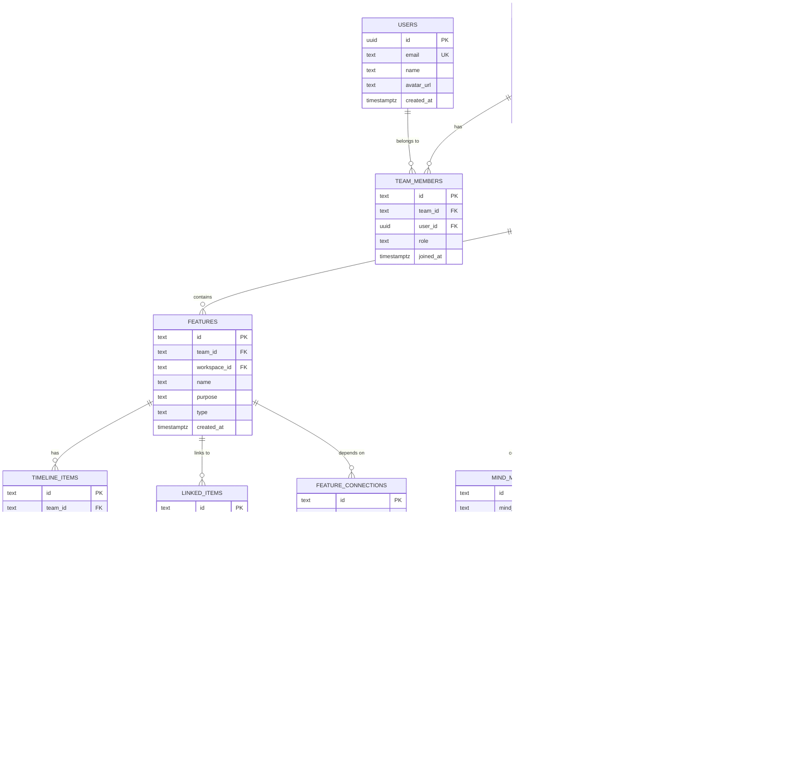
```mermaid
erDiagram
    USERS ||--o{ TEAM_MEMBERS : "belongs to"
    TEAMS ||--o{ TEAM_MEMBERS : "has"
    TEAMS ||--o{ WORKSPACES : "owns"
    TEAMS ||--o{ SUBSCRIPTIONS : "has"
    WORKSPACES ||--o{ FEATURES : "contains"
    WORKSPACES ||--o{ MIND_MAPS : "contains"
    FEATURES ||--o{ TIMELINE_ITEMS : "has"
    FEATURES ||--o{ LINKED_ITEMS : "links to"
    FEATURES ||--o{ FEATURE_CONNECTIONS : "depends on"
    MIND_MAPS ||--o{ MIND_MAP_NODES : "contains"
    MIND_MAPS ||--o{ MIND_MAP_EDGES : "contains"
    MIND_MAP_NODES ||--o{ MIND_MAP_EDGES : "connects"
    WORKSPACES ||--o{ REVIEW_LINKS : "generates"
    REVIEW_LINKS ||--o{ FEEDBACK : "receives"

    USERS {
        uuid id PK
        text email UK
        text name
        text avatar_url
        timestamptz created_at
    }

    TEAMS {
        text id PK
        text name
        uuid owner_id FK
        text plan
        int member_count
        text stripe_customer_id UK
        timestamptz created_at
    }

    TEAM_MEMBERS {
        text id PK
        text team_id FK
        uuid user_id FK
        text role
        timestamptz joined_at
    }

    SUBSCRIPTIONS {
        text id PK
        text team_id FK
        text stripe_subscription_id UK
        text status
        text plan_id
        timestamptz current_period_start
        timestamptz current_period_end
    }

    WORKSPACES {
        text id PK
        text team_id FK
        text name
        text description
        text phase
        jsonb enabled_modules
        timestamptz created_at
    }

    FEATURES {
        text id PK
        text team_id FK
        text workspace_id FK
        text name
        text purpose
        text type
        timestamptz created_at
    }

    TIMELINE_ITEMS {
        text id PK
        text team_id FK
        text feature_id FK
        text timeline
        text difficulty
        text usp
        text integration_type
        timestamptz created_at
    }

    LINKED_ITEMS {
        text id PK
        text team_id FK
        text source_id FK
        text target_id FK
        text link_type
        timestamptz created_at
    }

    FEATURE_CONNECTIONS {
        text id PK
        text team_id FK
        text workspace_id FK
        text source_feature_id FK
        text target_feature_id FK
        text connection_type
        timestamptz created_at
    }

    MIND_MAPS {
        text id PK
        text team_id FK
        text workspace_id FK
        text name
        jsonb canvas_data
        timestamptz created_at
    }

    MIND_MAP_NODES {
        text id PK
        text mind_map_id FK
        text type
        text label
        jsonb position
        jsonb data
        text converted_to_feature_id
        timestamptz created_at
    }

    MIND_MAP_EDGES {
        text id PK
        text mind_map_id FK
        text source_node_id FK
        text target_node_id FK
        text type
        text label
        timestamptz created_at
    }

    REVIEW_LINKS {
        text id PK
        text workspace_id FK
        text token UK
        text type
        timestamptz expires_at
        timestamptz created_at
    }

    FEEDBACK {
        text id PK
        text review_link_id FK
        text feature_id FK
        text reviewer_email
        int rating
        text comment
        text status
        timestamptz created_at
    }
```

### Table Categories

**Core Tables (Multi-Tenancy):**
- `users` - User accounts (Supabase Auth)
- `teams` - Organizations
- `team_members` - Team membership with roles
- `subscriptions` - Stripe billing
- `workspaces` - Projects

**Feature Tables:**
- `features` - Top-level roadmap items
- `timeline_items` - MVP/SHORT/LONG breakdown
- `linked_items` - Feature relationships
- `feature_connections` - Dependency graph

**Mind Mapping Tables:**
- `mind_maps` - Canvas data
- `mind_map_nodes` - Individual nodes (5 types)
- `mind_map_edges` - Connections

**Review & Feedback Tables:**
- `review_links` - Public/invite/iframe links
- `feedback` - Reviewer submissions

---

## 🔐 AUTHENTICATION FLOW

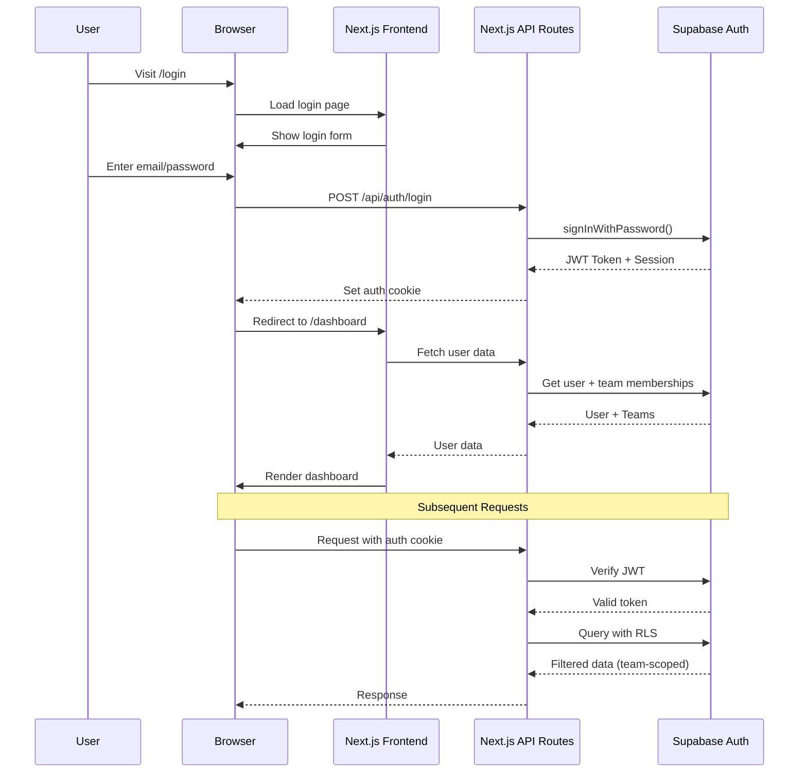
```mermaid
sequenceDiagram
    participant User
    participant Browser
    participant NextJS as Next.js Frontend
    participant API as Next.js API Routes
    participant Supabase as Supabase Auth

    User->>Browser: Visit /login
    Browser->>NextJS: Load login page
    NextJS->>Browser: Show login form

    User->>Browser: Enter email/password
    Browser->>API: POST /api/auth/login
    API->>Supabase: signInWithPassword()
    Supabase-->>API: JWT Token + Session
    API-->>Browser: Set auth cookie
    Browser->>NextJS: Redirect to /dashboard

    NextJS->>API: Fetch user data
    API->>Supabase: Get user + team memberships
    Supabase-->>API: User + Teams
    API-->>NextJS: User data
    NextJS->>Browser: Render dashboard

    Note over Browser,Supabase: Subsequent Requests
    Browser->>API: Request with auth cookie
    API->>Supabase: Verify JWT
    Supabase-->>API: Valid token
    API->>Supabase: Query with RLS
    Supabase-->>API: Filtered data (team-scoped)
    API-->>Browser: Response
```

### Auth Middleware

**Route Protection:**
```typescript
// middleware.ts
export async function middleware(req: NextRequest) {
  const supabase = createMiddlewareClient({ req, res });
  const { data: { session } } = await supabase.auth.getSession();

  // Protected routes
  if (!session && req.nextUrl.pathname.startsWith('/dashboard')) {
    return NextResponse.redirect(new URL('/login', req.url));
  }

  // Auth routes (redirect if logged in)
  if (session && ['/login', '/signup'].includes(req.nextUrl.pathname)) {
    return NextResponse.redirect(new URL('/dashboard', req.url));
  }

  return NextResponse.next();
}
```

---

## 🔄 DATA FLOW - KEY FEATURES

### Mind Map to Features Conversion

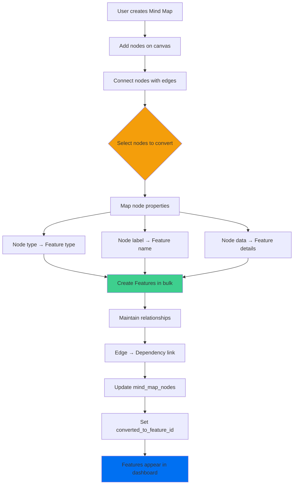
```mermaid
graph TD
    A[User creates Mind Map] --> B[Add nodes on canvas]
    B --> C[Connect nodes with edges]
    C --> D{Select nodes to convert}

    D --> E[Map node properties]
    E --> F[Node type → Feature type]
    E --> G[Node label → Feature name]
    E --> H[Node data → Feature details]

    F --> I[Create Features in bulk]
    G --> I
    H --> I

    I --> J[Maintain relationships]
    J --> K[Edge → Dependency link]

    K --> L[Update mind_map_nodes]
    L --> M[Set converted_to_feature_id]

    M --> N[Features appear in dashboard]

    style D fill:#f59e0b
    style I fill:#3ecf8e
    style N fill:#0070f3
```

### Dependency Graph Analysis

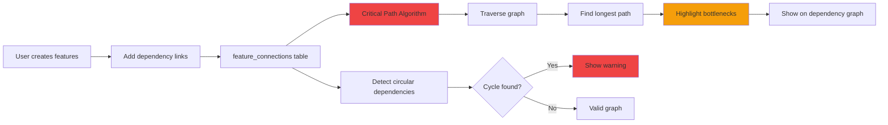
```mermaid
graph LR
    A[User creates features] --> B[Add dependency links]
    B --> C[feature_connections table]

    C --> D[Critical Path Algorithm]
    D --> E[Traverse graph]
    E --> F[Find longest path]

    F --> G[Highlight bottlenecks]
    G --> H[Show on dependency graph]

    C --> I[Detect circular dependencies]
    I --> J{Cycle found?}
    J -->|Yes| K[Show warning]
    J -->|No| L[Valid graph]

    style D fill:#ef4444
    style G fill:#f59e0b
    style K fill:#ef4444
```

### Real-time Collaboration Flow

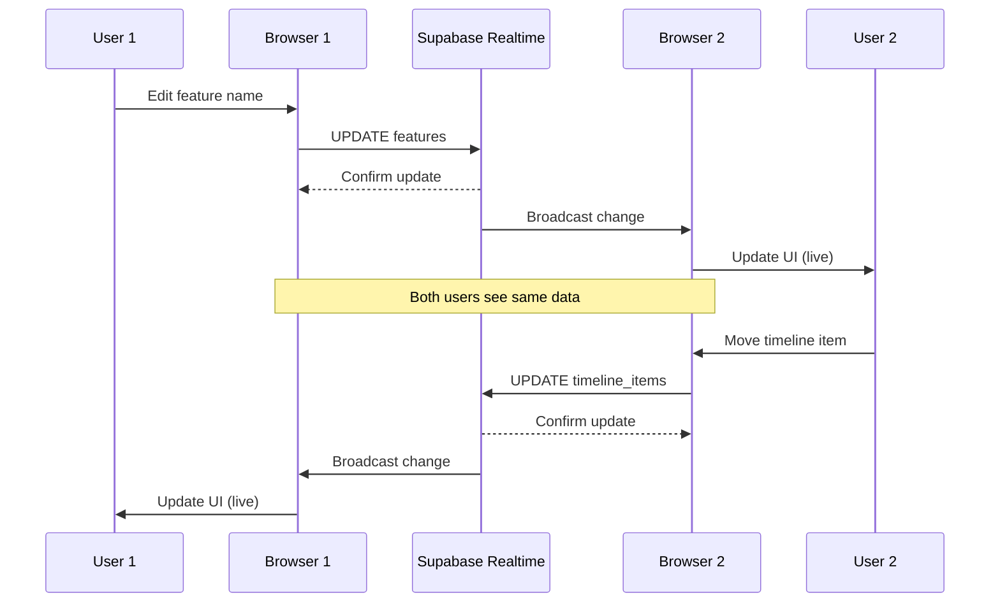
```mermaid
sequenceDiagram
    participant User1 as User 1
    participant Browser1 as Browser 1
    participant Supabase as Supabase Realtime
    participant Browser2 as Browser 2
    participant User2 as User 2

    User1->>Browser1: Edit feature name
    Browser1->>Supabase: UPDATE features
    Supabase-->>Browser1: Confirm update

    Supabase->>Browser2: Broadcast change
    Browser2->>User2: Update UI (live)

    Note over Browser1,Browser2: Both users see same data

    User2->>Browser2: Move timeline item
    Browser2->>Supabase: UPDATE timeline_items
    Supabase-->>Browser2: Confirm update

    Supabase->>Browser1: Broadcast change
    Browser1->>User1: Update UI (live)
```

---

## 🌐 API ARCHITECTURE

### API Routes Structure

```
next-app/app/api/
├── auth/
│   ├── login/route.ts
│   ├── signup/route.ts
│   ├── logout/route.ts
│   └── session/route.ts
├── teams/
│   ├── route.ts (GET, POST)
│   ├── [id]/route.ts (GET, PATCH, DELETE)
│   └── [id]/members/route.ts
├── workspaces/
│   ├── route.ts (GET, POST)
│   └── [id]/route.ts (GET, PATCH, DELETE)
├── features/
│   ├── route.ts (GET, POST)
│   ├── [id]/route.ts (GET, PATCH, DELETE)
│   └── [id]/timeline-items/route.ts
├── mind-maps/
│   ├── route.ts (GET, POST)
│   ├── [id]/route.ts (GET, PATCH, DELETE)
│   ├── [id]/nodes/route.ts
│   └── [id]/convert-to-features/route.ts
├── dependencies/
│   ├── route.ts (GET, POST)
│   ├── [id]/route.ts (DELETE)
│   └── analyze/route.ts (GET - critical path)
├── ai/
│   ├── chat/route.ts (POST - streaming)
│   ├── suggest/route.ts (POST - suggestions)
│   └── tools/route.ts (POST - agentic mode)
└── webhooks/
    ├── stripe/route.ts
    └── resend/route.ts
```

### API Response Pattern

```typescript
// Success Response
{
  success: true,
  data: { ... },
  message: "Operation successful"
}

// Error Response
{
  success: false,
  error: {
    code: "VALIDATION_ERROR",
    message: "Invalid input data",
    details: { ... }
  }
}
```

### API Middleware Stack

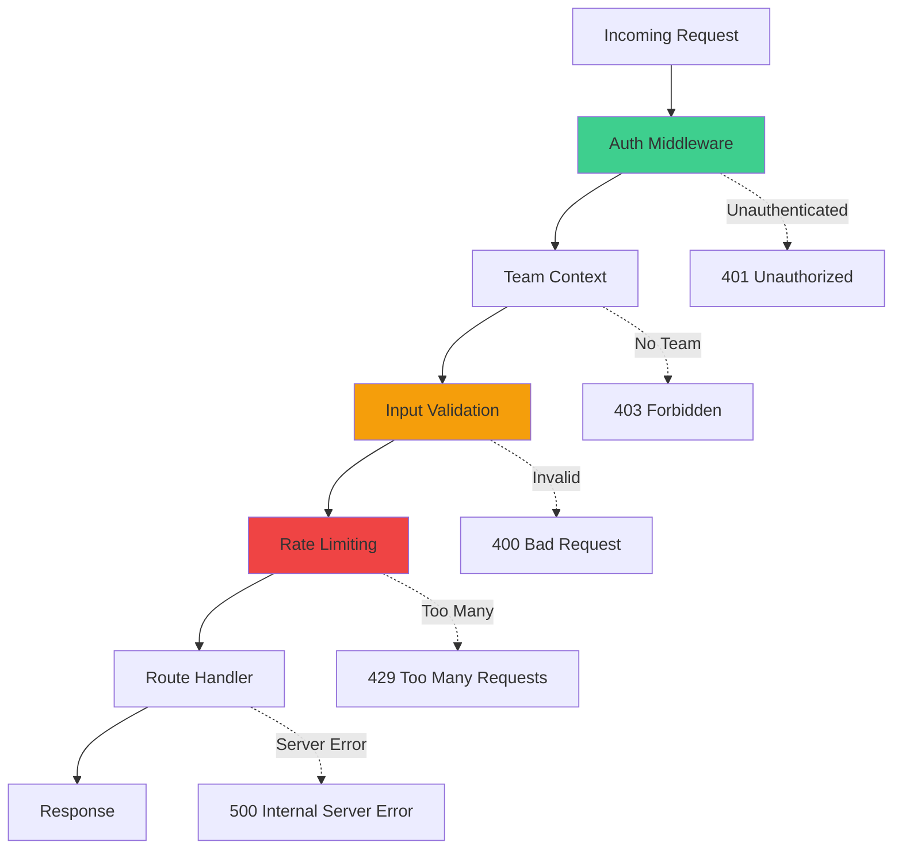
```mermaid
graph TD
    Request[Incoming Request] --> Auth[Auth Middleware]
    Auth --> Team[Team Context]
    Team --> Validation[Input Validation]
    Validation --> RateLimit[Rate Limiting]
    RateLimit --> Handler[Route Handler]
    Handler --> Response[Response]

    Auth -.Unauthenticated.-> Error401[401 Unauthorized]
    Team -.No Team.-> Error403[403 Forbidden]
    Validation -.Invalid.-> Error400[400 Bad Request]
    RateLimit -.Too Many.-> Error429[429 Too Many Requests]
    Handler -.Server Error.-> Error500[500 Internal Server Error]

    style Auth fill:#3ecf8e
    style Validation fill:#f59e0b
    style RateLimit fill:#ef4444
```

---

## 🔄 REAL-TIME COLLABORATION

### Supabase Realtime Architecture

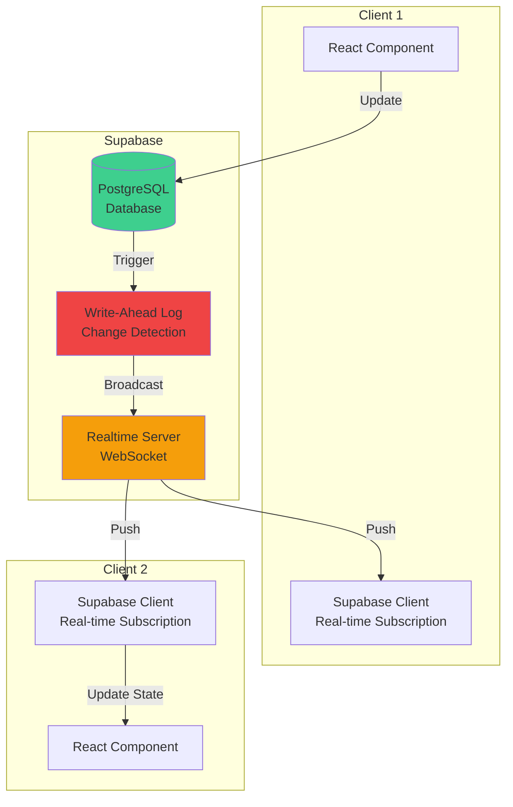
```mermaid
graph TB
    subgraph "Client 1"
        C1[React Component]
        Sub1[Supabase Client<br/>Real-time Subscription]
    end

    subgraph "Client 2"
        C2[React Component]
        Sub2[Supabase Client<br/>Real-time Subscription]
    end

    subgraph "Supabase"
        PG[(PostgreSQL<br/>Database)]
        RT[Realtime Server<br/>WebSocket]
        WAL[Write-Ahead Log<br/>Change Detection]
    end

    C1 -->|Update| PG
    PG -->|Trigger| WAL
    WAL -->|Broadcast| RT
    RT -->|Push| Sub1
    RT -->|Push| Sub2
    Sub2 -->|Update State| C2

    style PG fill:#3ecf8e
    style RT fill:#f59e0b
    style WAL fill:#ef4444
```

### Subscription Pattern

```typescript
// Subscribe to workspace changes
useEffect(() => {
  const channel = supabase
    .channel(`workspace_${workspaceId}`)
    .on(
      'postgres_changes',
      {
        event: '*',
        schema: 'public',
        table: 'features',
        filter: `workspace_id=eq.${workspaceId}`
      },
      (payload) => {
        // Handle INSERT, UPDATE, DELETE
        queryClient.invalidateQueries(['features', workspaceId]);
      }
    )
    .subscribe();

  return () => {
    channel.unsubscribe();
  };
}, [workspaceId]);
```

---

## ☁️ DEPLOYMENT ARCHITECTURE

### Vercel Deployment

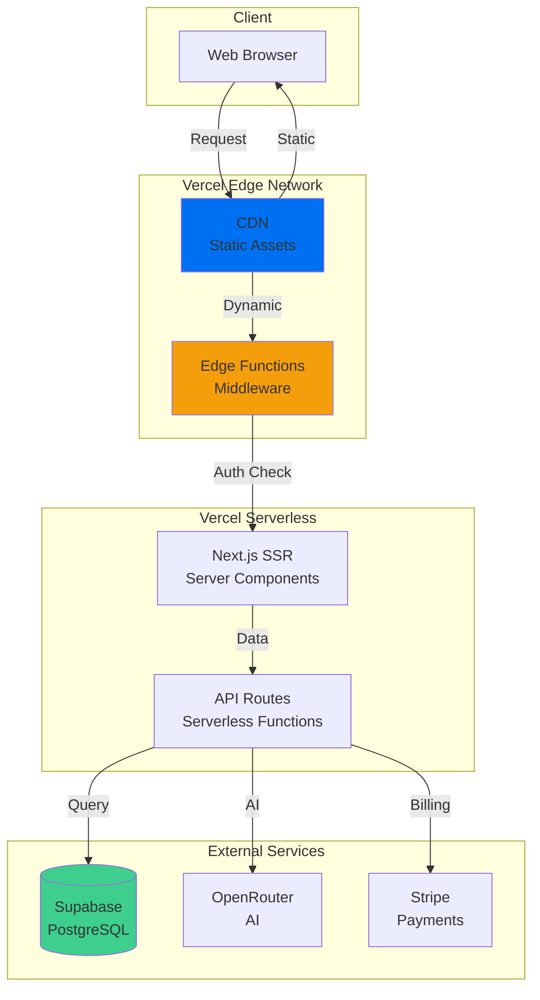
```mermaid
graph TB
    subgraph "Client"
        Browser[Web Browser]
    end

    subgraph "Vercel Edge Network"
        CDN[CDN<br/>Static Assets]
        Edge[Edge Functions<br/>Middleware]
    end

    subgraph "Vercel Serverless"
        SSR[Next.js SSR<br/>Server Components]
        API[API Routes<br/>Serverless Functions]
    end

    subgraph "External Services"
        Supabase[(Supabase<br/>PostgreSQL)]
        OpenRouter[OpenRouter<br/>AI]
        Stripe[Stripe<br/>Payments]
    end

    Browser -->|Request| CDN
    CDN -->|Static| Browser
    CDN -->|Dynamic| Edge
    Edge -->|Auth Check| SSR
    SSR -->|Data| API
    API -->|Query| Supabase
    API -->|AI| OpenRouter
    API -->|Billing| Stripe

    style CDN fill:#0070f3
    style Edge fill:#f59e0b
    style Supabase fill:#3ecf8e
```

### Environment Configuration

```bash
# Supabase
NEXT_PUBLIC_SUPABASE_URL=https://xxx.supabase.co
NEXT_PUBLIC_SUPABASE_ANON_KEY=xxx
SUPABASE_SERVICE_ROLE_KEY=xxx

# OpenRouter (AI)
OPENROUTER_API_KEY=xxx

# Stripe (Payments)
STRIPE_SECRET_KEY=sk_live_xxx
STRIPE_WEBHOOK_SECRET=whsec_xxx
NEXT_PUBLIC_STRIPE_PUBLISHABLE_KEY=pk_live_xxx

# Resend (Email)
RESEND_API_KEY=re_xxx

# App Config
NEXT_PUBLIC_APP_URL=https://platform-test-cyan.vercel.app
```

---

## 🛠️ TECHNOLOGY STACK DETAILS

### Frontend Stack


```mermaid
graph LR
    subgraph "Framework"
        NextJS[Next.js 15<br/>App Router + RSC]
    end

    subgraph "Language"
        TS[TypeScript 5.x<br/>Strict Mode]
    end

    subgraph "UI Library"
        shadcn[shadcn/ui<br/>Radix UI]
        Tailwind[Tailwind CSS 3.x]
        Lucide[Lucide React<br/>Icons]
    end

    subgraph "State Management"
        ReactQuery[React Query<br/>Server State]
        Zustand[Zustand<br/>Client State]
    end

    subgraph "Specialized"
        ReactFlow[ReactFlow<br/>Mind Mapping]
        Recharts[Recharts<br/>Analytics]
    end

    NextJS --> TS
    TS --> shadcn
    TS --> ReactQuery
    TS --> ReactFlow
    shadcn --> Tailwind
    shadcn --> Lucide
    ReactQuery --> Zustand
    ReactFlow --> Recharts

    style NextJS fill:#0070f3
    style TS fill:#3178c6
    style shadcn fill:#18181b
```

### Backend Stack

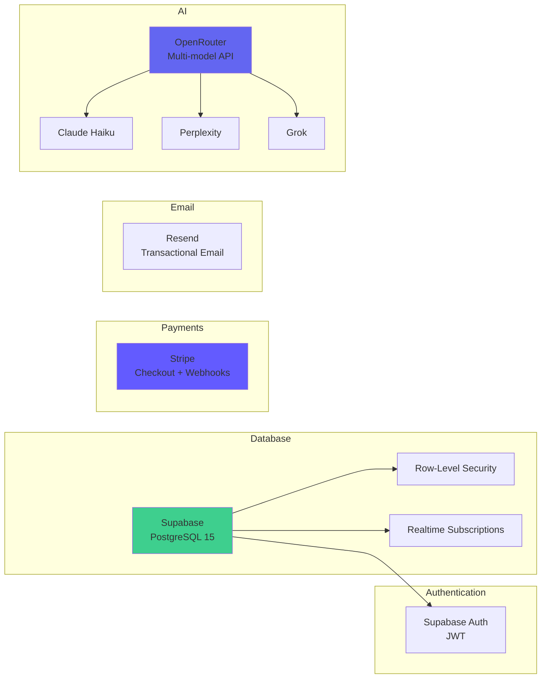
```mermaid
graph LR
    subgraph "Database"
        Supabase[Supabase<br/>PostgreSQL 15]
        RLS[Row-Level Security]
        Realtime[Realtime Subscriptions]
    end

    subgraph "Authentication"
        SupabaseAuth[Supabase Auth<br/>JWT]
    end

    subgraph "Payments"
        Stripe[Stripe<br/>Checkout + Webhooks]
    end

    subgraph "Email"
        Resend[Resend<br/>Transactional Email]
    end

    subgraph "AI"
        OpenRouter[OpenRouter<br/>Multi-model API]
        Claude[Claude Haiku]
        Perplexity[Perplexity]
        Grok[Grok]
    end

    Supabase --> RLS
    Supabase --> Realtime
    Supabase --> SupabaseAuth
    OpenRouter --> Claude
    OpenRouter --> Perplexity
    OpenRouter --> Grok

    style Supabase fill:#3ecf8e
    style Stripe fill:#635bff
    style OpenRouter fill:#6366f1
```

### Testing Stack

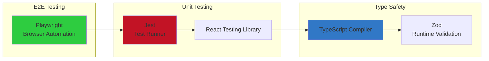
```mermaid
graph LR
    subgraph "E2E Testing"
        Playwright[Playwright<br/>Browser Automation]
    end

    subgraph "Unit Testing"
        Jest[Jest<br/>Test Runner]
        RTL[React Testing Library]
    end

    subgraph "Type Safety"
        TSC[TypeScript Compiler]
        Zod[Zod<br/>Runtime Validation]
    end

    Playwright --> Jest
    Jest --> RTL
    RTL --> TSC
    TSC --> Zod

    style Playwright fill:#2ecc40
    style Jest fill:#c21325
    style TSC fill:#3178c6
```

---

## 📊 PERFORMANCE CONSIDERATIONS

### Data Loading Strategy

**1. Server Components (RSC)**
- Fetch data on server
- No client-side loading states
- Automatic code splitting

**2. React Query (Client State)**
- Cache server data
- Background refetching
- Optimistic updates

**3. Streaming SSR**
- Progressive page rendering
- Suspense boundaries
- Priority-based loading

### Caching Strategy

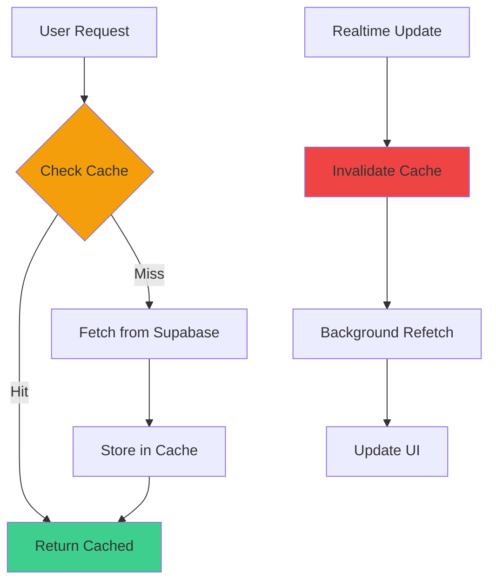
```mermaid
graph TD
    Request[User Request] --> Cache{Check Cache}
    Cache -->|Hit| Return[Return Cached]
    Cache -->|Miss| Fetch[Fetch from Supabase]
    Fetch --> Store[Store in Cache]
    Store --> Return

    Realtime[Realtime Update] --> Invalidate[Invalidate Cache]
    Invalidate --> Refetch[Background Refetch]
    Refetch --> Update[Update UI]

    style Cache fill:#f59e0b
    style Return fill:#3ecf8e
    style Invalidate fill:#ef4444
```

---

## 🔒 SECURITY ARCHITECTURE

### Security Layers

```mermaid
graph TD
    User[User] --> HTTPS[HTTPS/TLS<br/>Encrypted Transport]
    HTTPS --> Vercel[Vercel Edge<br/>DDoS Protection]
    Vercel --> Auth[Authentication<br/>JWT Validation]
    Auth --> RLS[Row-Level Security<br/>Database Isolation]
    RLS --> Validation[Input Validation<br/>Zod Schemas]
    Validation --> API[API Logic]

    style HTTPS fill:#3ecf8e
    style Auth fill:#f59e0b
    style RLS fill:#ef4444
```

### Threat Mitigation

| Threat | Mitigation |
|--------|------------|
| **SQL Injection** | Supabase prepared statements, Zod validation |
| **XSS** | React auto-escaping, Content Security Policy |
| **CSRF** | SameSite cookies, CORS configuration |
| **Data Leakage** | RLS policies, team_id filtering |
| **Rate Limiting** | Vercel Edge, API middleware |
| **DDoS** | Vercel Edge Network, CDN |

---

## 📚 REFERENCES

- **Next.js Documentation**: [https://nextjs.org/docs](https://nextjs.org/docs)
- **Supabase Documentation**: [https://supabase.com/docs](https://supabase.com/docs)
- **ReactFlow Documentation**: [https://reactflow.dev](https://reactflow.dev)
- **Stripe Documentation**: [https://stripe.com/docs](https://stripe.com/docs)

---

## 🔗 RELATED DOCUMENTATION

- [Implementation Plan](../implementation/README.md) - Detailed implementation timeline
- [API Reference](API_REFERENCE.md) - API endpoints documentation
- [Project Guidelines](../../CLAUDE.md) - Project guidelines and coding standards
- [README](../../README.md) - Project overview and quick start

---

**Last Updated**: 2025-11-14
**Version**: 1.0
**Status**: Living Document (update as architecture evolves)
